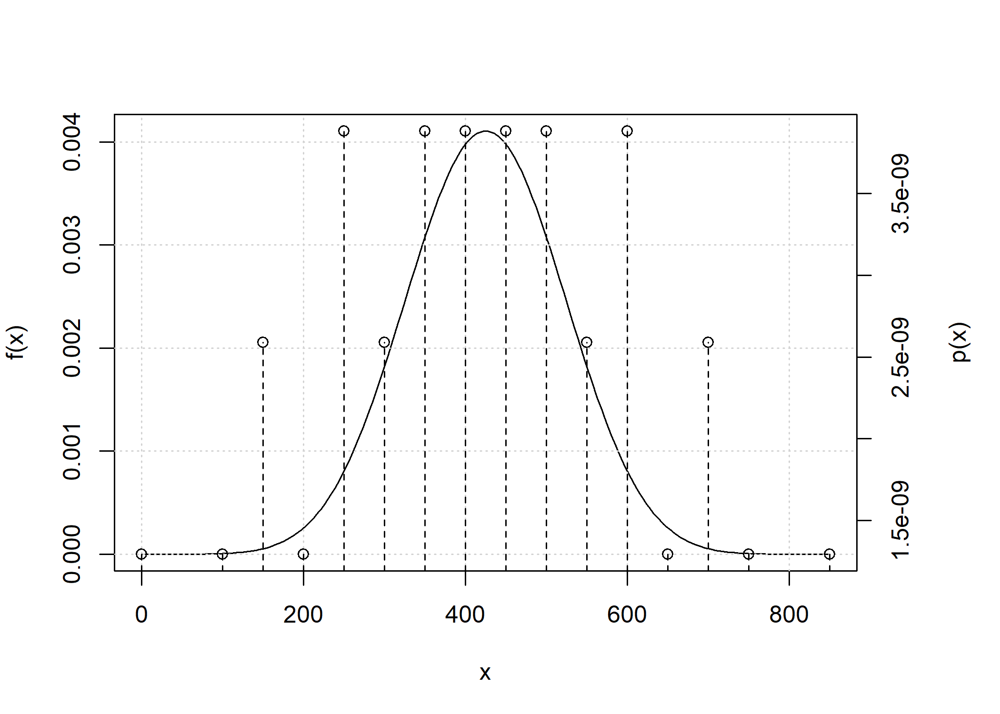
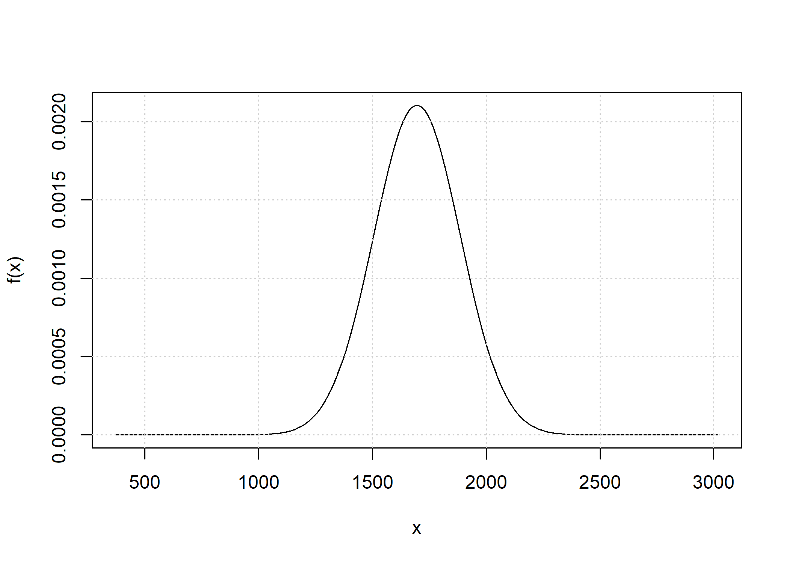

<!-- README.md is generated from README.Rmd. Please edit that file -->

## Introduction

The **ibdsegments** package offers functions related to identity by
descent (IBD) probability for pedigree members. Both the discrete case
(identity coefficients) and the continuous case (segments length) are
treated using a Hidden Markov Model (HMM) approach. Key functionality
includes:

- Computing identity coefficients for two pedigree members
- Random sampling of IBD segments
- Obtaining the full probability distribution of the fraction (or total
  length) of an autosome that is IBD between two or more pedigree
  members
- Convolution of IBD distributions using the FFT

## Getting started

``` r
library(ibdsegments)
#> 
#> Attaching package: 'ibdsegments'
#> The following objects are masked from 'package:stats':
#> 
#>     sd, var
```

#### Identity coefficients

The `d_ibd` function may be used to compute identity coefficients. The
example shows how to compute the `kappa` coefficients for half siblings.

``` r
ped_hs <- pedtools::halfSibPed()

d_ibd(0, pedigree = ped_hs, coefficients = "kappa")
#> [1] 0.5
d_ibd(1, pedigree = ped_hs, coefficients = "kappa")
#> [1] 0.5
```

Besides `kappa`, other identity coefficients supported include:

- `ibd`: 0, 1, or 2 whenever all selected pedigree members jointly share
  this number of founder allele labels
- `identity`: Jacquard’s 9 condensed identity coefficients
- `detailed`: the 15 detailed identity coefficients

For example, the inbreeding coefficient may be computed as an `ibd`
state for a single person.

``` r
ped_inbred <- pedtools::fullSibMating(n = 1)
d_ibd(ibd = 1, pedigree = ped_inbred, persons = 5, coefficients = "ibd")
#> [1] 0.25
```

The probability that three siblings are jointly double ibd is also
easily computed using the `d_ibd` function.

``` r
ped_3fs <- pedtools::nuclearPed(nch = 3)
d_ibd(ibd = 2, pedigree = ped_3fs, coefficients = "ibd")
#> [1] 0.0625
```

#### Random sampling of IBD segments

The identity coefficients computed above are IBD probabilities at single
positions on a chromosome. Taking a continuous view, the fraction of the
chromosome that is in each of the states is in expectation equal to
these IBD probabilities. The `r_cibd` functions implements random
sampling of continuous IBD:

``` r
set.seed(1)
r_cibd(n = 1, pedigree = ped_hs, coefficients = "kappa", chromosome_length = 100)
#> $samples
#>   sample chromosome    start       end    length state
#> 1      1          1  0.00000  59.08214 59.082139     1
#> 2      1          1 59.08214  66.07190  6.989763     0
#> 3      1          1 66.07190  82.15168 16.079779     1
#> 4      1          1 82.15168 100.00000 17.848319     0
#> 
#> $stats
#>   total_length segments
#> 1     75.16192        2
```

### IBD distribution

The `total_ibd_dist` function obtains the full distribution of the total
length of IBD segments across a chromosome. For example, we may obtain
this distribution for half siblings on a chromosome with a length of 100
cM.

``` r
d_hs <- total_ibd_dist(ped_hs, chromosome_length = 100)
d_hs
#> Probability distribution of total length of segments in ibd state 1  
#> Chromosome length: 100 cM
#> 
#> Weight of continuous density: 0.8646647 
#> 
#> Point masses: 
#>    x         px
#>    0 0.06766764
#>  100 0.06766764
```

The distribution has two point masses (no IBD at all and fully IBD) and
admits a density function otherwise. A plot includes both components.

``` r
plot(d_hs)
```


Utility functions for computing the expectation, variance and standard
deviation of the distributions are also available. These functions use
numerical integration.

``` r
E(d_hs)
#> [1] 50
sd(d_hs)
#> [1] 30.71195
```

## Convolution of IBD distributions

The convolution of the total IBD distribution across chromosomes is
obtained when the `chromosome_length` parameter has length greater than
1.

``` r
d_hs_conv <- total_ibd_dist(ped_hs, 
                       chromosome_length = c(250, 200, 150, 150, 100))
plot(d_hs_conv)
```



Because the number of point masses may increase quickly, by default any
point mass below `1e-9` is removed.

``` r
L <- c(267.77, 251.73, 218.31, 202.89, 197.08, 186.02, 178.4, 161.54, 
       157.35, 169.28, 154.5, 165.49, 127.23, 116, 117.32, 126.59, 129.53, 
       116.52, 106.35, 107.76, 62.88, 70.84)

d_hs_full_conv <- total_ibd_dist(ped_hs, chromosome_length = L)
d_hs_full_conv
#> Probability distribution of total length of segments in ibd state 1  
#> Chromosome length: 62.88 70.84 106.35 107.76 116 116.52 117.32 126.59 127.23 129.53 154.5 157.35 161.54 165.49 169.28 178.4 186.02 197.08 202.89 218.31 251.73 267.77 cM
#> 
#> Weight of continuous density: 1 
#> 
#> Point masses: 
#>  x           px
#>  0 8.321233e-37
plot(d_hs_full_conv)
```


